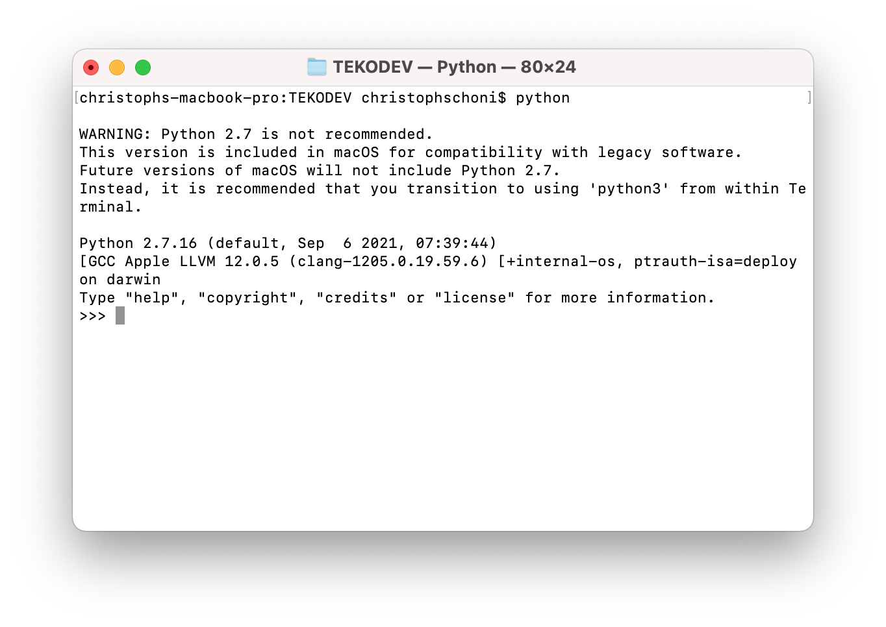
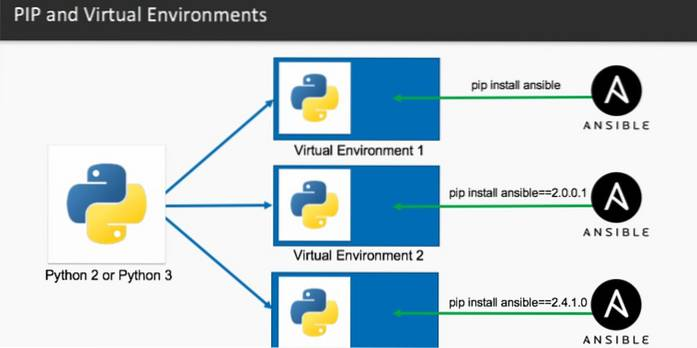
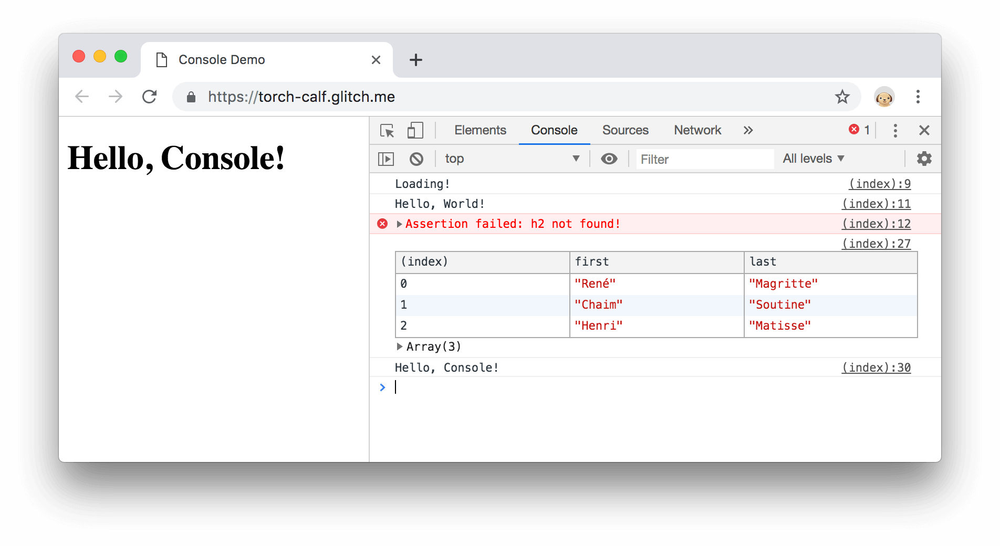

# TEKO DEV
Diese Projekt ist für das Verständis zum Programmieren erstellt worden. Wir werden in diesem Projekt mit Datenbanken arbeiten, ihr werdet ein Verständis erhalten wie das Routing funktioniert. Es wird ein Einblick in HTML und CSS geben, sowie weitere Interessante Themen wie API aufbau etc. 

## Lektion 1 - Installation (lession-1_install_django)

### Python 
Damit wir mit Python etwas programmieren können, benötigst du Python auf deinem Computer. Dies kannst du einfach installieren gehen. Gehe dazu auf https://www.python.org/downloads/ und installiere dir die neuste stabile Version herunter.



### Python Environment 

Damit wir nicht unnötig Packages auf dem PC installieren, die wir vieleicht nur einmal in einem Projekt benötigen, können wir mit einer Python Environment arbeiten. Diese stellt und Virtuall eine Python Umgebung bereit. In dieser können wir Packete installieren und normal an einem Projekt arbeiten, ohne dass wir Packete auf dem PC direkt installieren. 



Hast du ein neues Projekt so kannst du in den Ordner des neuen Projektes gehen, eine neue Environment anlegen und in dieser andere Pakete installieren. 

Zudem hilft es sehr, wenn an deinem Projekt mehrere Personen arbeiten. Denn wenn jede Person auf seinem PC eine andere Version von Python mit anderen Versionen von Packeten hat, so ist es fast unmöglich an einem Projekt gemeinsam zu arbeiten. 

Mithilfe dieser Environment hat jeder die gleiche voraussetzung, egal auf welchem Gerät das Projekt ausgeführt wird. 

### Vorgehen bei Windows
1. Gehe nach dieser [Anleitung](https://www.liquidweb.com/kb/install-pip-windows/) zur Installation von PIP.

### Aufgabe
##### Vorgehen bei OSX / Linux
1. Öffne ein Terminal 
2. Füge das im Terminal ein ``` python -m ensurepip --upgrade ```
3. Drücke die Enter Taste

##### Visual Code Studio
Wir könnten eigentlich das Projekt in einem normalen Editor schreiben. Damit es jedoch ein bischen Einfacher ist und weniger Fehler gemacht werden, hilft hier ein Code Editor oder eine IDE. 

In unserem Beispiel arbeiten wir mit Visual Code Studio. Es gibt aber noch einen haufen anderer Anwendungen die für Pyton verwendet werden können. Sehe dir mal dazu diesen link an. [Verfügbare IDE's](https://en.wikipedia.org/wiki/Source-code_editor)

### Aufgabe
#### Vorgehen für Windows & OSX / Linux
1. Gehe auf die Webseite von[Visual Studio Code](https://code.visualstudio.com/)
2. Lade die letze Verion herunter
3. Installiere nun Visual Studio Code auf deinem PC. Das Installationspaket findest du in deinem Download Ordner.


## Browser
Für die Entwicklung benötigst du natürlich auch die Software, auf der du dein Ergebnis siehst. Das kann Chrome, Firefox oder einfach dein EdgeBrowser sein. Wichtig er sollte über eine Entwickler Konsole verfügen. 




## Lektion 3 - Aufbau des Projektes anschauen (lession-3_view_the_structure_of_the_django_project)
In dieser Lektion wollen wir uns mal das Projekt erstellen und anschliessend mal anschauen was sich da drin so alles verbirgt. Denn Django ist nicht wie normalerweise in JS bekannte Bibliothek, die dann von 0 an aufgebaut wird, sondern ein bereits funktionierende Webanwendung. Mit etwas Code erhälst du bereits ein Login und die Möglichkeit Daten zu erfassen. 

### Django Projekt erstellen
Erstelle ein neues Projekt mithilfe des Befehls ```django-admin```. 

1. Gebe folgenden Befehl ``` django-admin startproject mySchool ```für ein neues Projekt ein.
2. Anschliessend erstellt dir django-admin in deinem Ordner ein neues Projekt mit dem mySchool
3. Anschliessend kannst du mit cd ```mySchool``` in den Ordner wechseln. 
4. Dieser Ordner wird dann das Projekt und deine Apps beinhalten. 


### settings.py
In Settings kannst du Einstellungen für dein Projekt vornehmen. Dazu Wirst du in deiner Entwickler Karriere immer mal wieder etwas in dein Projekt hinzufügen, dass du dann aufgefordert wirst die Informationen zu den Einstellungen in settings entweder hinzuzufügen oder aber zu ändern. 

### urls.py
In Urls wirst du in Zukunft deine Routes hinzufügen. Mit Routes ist es erst möglich später Seiten über Links aufzurufen. Ich habe dir dafür mal ein Beispiel hinzugefügt. 

##### Beispiel von Routes:
```
/ 
/shop
/kontakte
/ueber_uns
```

## Lektion 4 - Django App erstellen und in Settings registrieren (lesson-4_create_my_first_app)
Das Projekt beinhaltet deine jeweiligen Apps. Was genau ein App ist, werde ich dir noch erklären. 

1. Erstelle ein neues App mit dem Befehl ```python manage.py startapp students ```. 

Anschliessend erstellen wir für den Administrativen Zugriff im Admin UI einen Benutzer. 

Aufgabe (Superuser)
> Welcher Befehl muss für das erstellen eines Superusers verwendet werden?


## Lektion 5 - Das Model für dein App erstellen (lesson-5_add_models_for_students_app)
Erstelle mit Models deine Datenbank Modelle. Gehe in einem ersten Schritt nach dem Thema im Unterricht auf folgendes Video. Versuche selbst mal ein oder zwei Models zu erstellen. 

[Django Models](https://www.youtube.com/watch?v=5zNR3E6WRLE)

Mit dem befehl ```pip install -r requirements.txt``` kannst du alle Packete auf einmal installieren. 
Beachte jedoch, dass du dich in diesem Ordner befindest, in dem das File abgelegt ist. In meinem Fall ist das in mySchool.
 


#### Interessante Webseiten
[Offizielle Django Webseite (free)](https://www.djangoproject.com/)
[Django Girls Tutorial (free)](https://tutorial.djangogirls.org/de/)
[Django on Udemy (premium)](https://www.udemy.com/courses/search/?src=ukw&q=Django)

#### Video Tutorials
[Django Tutorial auf Deutsch](https://www.youtube.com/watch?v=3_cNvo2_iUo&list=PLva9kPwWCvPsHqeAeoSxji6EZeZim9uZn)
[Python Django 7 Hour Course](https://www.youtube.com/watch?v=PtQiiknWUcI&t=166s)
[Python Tutorial Deutsch (Komplettkurs) - Python lernen in unter 4 Stunden](https://www.youtube.com/watch?v=RBpK8C3N-Y8)

#### Django Tutorials
[Django Girls Tutorial](https://tutorial.djangogirls.org/de/)

#### Django Blogs
[Schweizer Django Blog](https://www.djangoblog.ch/de/django/django-superkraft-eine-crud-web-app-in-60-minuten-teil-1/)5
[Silicon Valley Kids - Django Blog](https://www.sivakids.de/python-django/)
[Tutorial: Erste Schritte mit dem Django-Webframework in Visual Studio](https://docs.microsoft.com/de-de/visualstudio/python/learn-django-in-visual-studio-step-01-project-and-solution?view=vs-2022)


## Lösung
Die Lösungen zu den Fragen, die ich oben gestellt habe.

### Aufgabe (Superuser)
Der Befehl ```django-admin createsuperuser``` startet ein Script, dass dir einige Fragen stellt. 
1. Als erstes musst du nach dem drücken der Enter Taste ein Benutzername eingeben
2. Danach will er eine E-Mail Adresse von dir. 
3. Anschliessend ein Kennwort und das nach dem betätigen nochmals eingeben. 

> Achtung: Du wirst das Kennwort nicht sehen (Auf derm Terminal werden beim eintippen eines Kennworts nicht dargestellt).

Quelle: [django-admin and manage.py¶ - createsuperuser](https://docs.djangoproject.com/en/4.0/ref/django-admin/#django-admin-createsuperuser)

