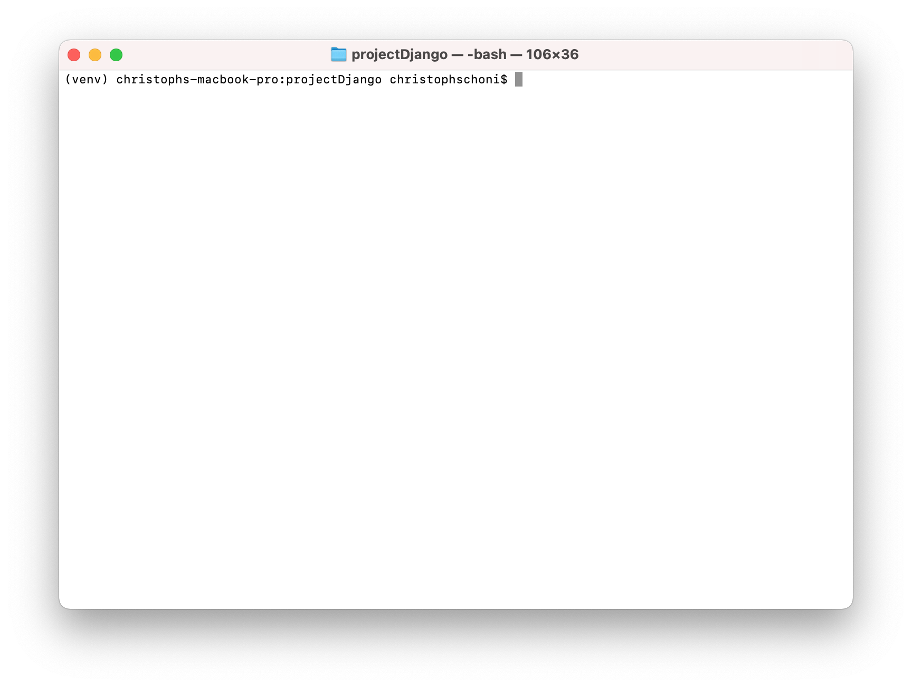
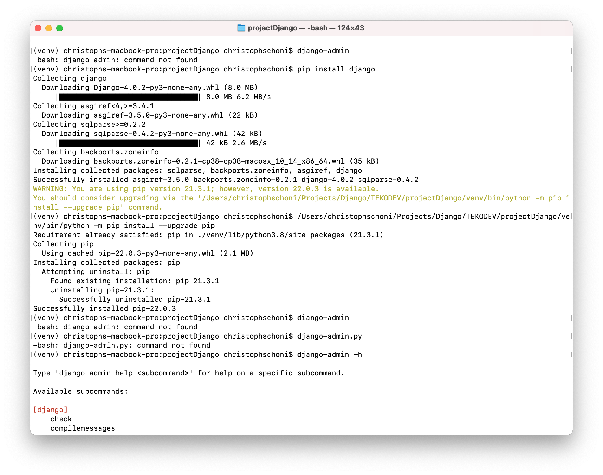

# TEKO DEV
Diese Projekt ist für das Verständis zum Programmieren erstellt worden. Wir werden in diesem Projekt mit Datenbanken arbeiten, ihr werdet ein Verständis erhalten wie das Routing funktioniert. Es wird ein Einblick in HTML und CSS geben, sowie weitere Interessante Themen wie API aufbau etc. 

## Lektion 1 - Installation

### Python 
Damit wir mit Python etwas programmieren können, benötigst du Python auf deinem Computer. Dies kannst du einfach installieren gehen. Gehe dazu auf https://www.python.org/downloads/ und installiere dir die neuste stabile Version herunter.


### Python Environment 

Damit wir nicht unnötig Packages auf dem PC installieren, die wir vieleicht nur einmal in einem Projekt benötigen, können wir mit einer Python Environment arbeiten. Diese stellt und Virtuall eine Python Umgebung bereit. In dieser können wir Packete installieren und normal an einem Projekt arbeiten, ohne dass wir Packete auf dem PC direkt installieren. 


Hast du ein neues Projekt so kannst du in den Ordner des neuen Projektes gehen, eine neue Environment anlegen und in dieser andere Pakete installieren. 

Zudem hilft es sehr, wenn an deinem Projekt mehrere Personen arbeiten. Denn wenn jede Person auf seinem PC eine andere Version von Python mit anderen Versionen von Packeten hat, so ist es fast unmöglich an einem Projekt gemeinsam zu arbeiten. 

Mithilfe dieser Environment hat jeder die gleiche voraussetzung, egal auf welchem Gerät das Projekt ausgeführt wird. 

### Vorgehen bei Windows
1. Gehe nach dieser [Anleitung](https://www.liquidweb.com/kb/install-pip-windows/) zur Installation von PIP.

### Aufgabe
##### Vorgehen bei OSX / Linux
1. Öffne ein Terminal 
2. Füge das im Terminal ein ``` python -m ensurepip --upgrade ```
3. Drücke die Enter Taste

##### Visual Code Studio
Wir könnten eigentlich das Projekt in einem normalen Editor schreiben. Damit es jedoch ein bischen Einfacher ist und weniger Fehler gemacht werden, hilft hier ein Code Editor oder eine IDE. 

In unserem Beispiel arbeiten wir mit Visual Code Studio. Es gibt aber noch einen haufen anderer Anwendungen die für Pyton verwendet werden können. Sehe dir mal dazu diesen link an. [Verfügbare IDE's](https://en.wikipedia.org/wiki/Source-code_editor)

### Aufgabe
#### Vorgehen für Windows & OSX / Linux
1. Gehe auf die Webseite von[Visual Studio Code](https://code.visualstudio.com/)
2. Lade die letze Verion herunter
3. Installiere nun Visual Studio Code auf deinem PC. Das Installationspaket findest du in deinem Download Ordner.


## Browser
Für die Entwicklung benötigst du natürlich auch die Software, auf der du dein Ergebnis siehst. Das kann Chrome, Firefox oder einfach dein EdgeBrowser sein. Wichtig er sollte über eine Entwickler Konsole verfügen. 


## Lektion 2 - Django Projekt erstellen (lession-2_create_django_project)

### Ertelle deine Environment
Damit wir nun unser Django Projekt erstellen können, benötigt es einmal eine Evnironemnt. 

Dazu benötigen wir ein Globales Paket mit dem Namen django-environ. 

### Aufgabe

#### Windows
1. Öffne das Terminal
2. Füge den Befehl ``` pip install virtualenvwrapper-win ``` hinzu.
3. Drücke Enter um das Paket auf deinem Gerät zu installieren
4. Erstelle einen neuen Ordner mit dem Namen projectDjango
5. Anschliessend kannst du mit dem Befehl ``` py -m venv venv ``` eine neue Environment erstellen. 
6. Mit dem Befehl ``` venv\Scripts\activate.bat ``` kannst du deine Environment starten.

#### OSX / Linux
1. Öffne das Terminal
2. Füge den Befehl ``` sudo pip3 install virtualenv  ``` hinzu.
3. Drücke Enter um das Paket auf deinem Gerät zu installieren
4. Anschliessend kannst du mit dem Befehl ``` sudo pip3 install virtualenv ``` installieren
5. Anschliessend kannst du diese Aktivieren mit ``` virtualenv venv -p python3 ```
6. Mit dem Befehl ```source venv/bin/activate ```kannst du deine Environment aktivieren. 
7 Mit dem Befehl ``` deactivate ``` kannst du die Environemnt wieder deaktivieren.




### Django installieren
Sobald wir in der Environment sind, können wir das im Terminal sehen. 

#### Windows
1. Mit dem Befehl ``` pip install django ``` installierst du das Django Package in deiner Environment. 
2. Mit dem Befehl ``` django-admin.py ``` kannst du alle Befehle ansehen, die dir das Packet von Django beinhaltet. 
3. Erstell ein Projekt mit dem Befehl ``` django-admin.py startproject project1 ```
4. Mit dem Befehl ``` python manage.py runserver ``` kannst du den Server starten. 

#### OS X
1. Mit dem Befehl ``` pip install Django ``` kannst du in deiner Environment das Packet für Django herunterladen. 
2. Mit dem Befehl ``` django-admin.py ``` kannst du alle Befehle ansehen, die dir das Packet von Django beinhaltet. 
3. Erstell ein Projekt mit dem Befehl ``` django-admin.py startproject project1 ```
4. Mit dem Befehl ``` python manage.py runserver ``` kannst du den Server starten. 


Sobald Django auf deiner Environment installiert ist, kannst du sehen welche Funktionen ```django-admin``` bietet.



Somit ist unsere Environment bereit für das erste Projekt. 